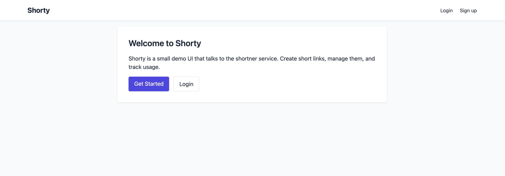
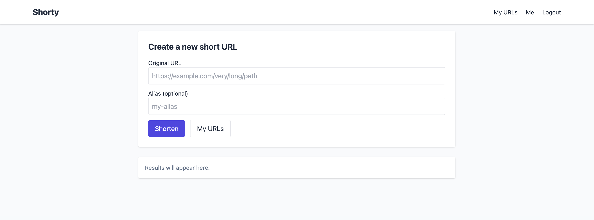
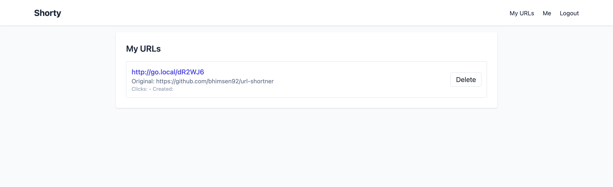

# FastURL — A simple, fast URL shortener

A small, practical URL shortener built with **FastAPI**, **HTMX** (server-driven UI), **Postgres** for persistence, and **Redis** for caching / counters. Designed to run locally (or on a server) using **Docker Compose**.

**TL;DR** — Have Docker Compose?

```bash
docker compose up
```

---

## Table of contents

* [What this repo contains](#what-this-repo-contains)
* [Tech stack](#tech-stack)
* [Features](#features)
* [Prerequisites](#prerequisites)
* [Quickstart](#quickstart)
* [Running locally](#running-locally)
* [API](#api)

  * [Create a short URL](#create-a-short-url)
  * [Redirect](#redirect)
  * [Stats](#stats)
* [Database migrations](#database-migrations)
* [Production notes](#production-notes)
* [Images](#ui-screenshots)
* [Contributing](#contributing)

---

## What this repo contains

* FastAPI backend exposing:

  * HTMX-powered web UI to create & manage short links
  * JSON API endpoints to create short links and fetch stats
  * Redirect endpoint (`/<alias>`) that issues a 302 to the original URL
* PostgreSQL to store mappings and analytics
* Redis used for caching and counters
* Docker Compose to run everything locally with one command

---

## Tech stack

* **Backend:** FastAPI (Python)
* **Frontend:** HTMX + server-rendered templates
* **Database:** PostgreSQL
* **Cache / counters:** Redis
* **Orchestration:** Docker Compose
* **Web Server/Reverse Proxy:** Nginx

---

## Features

* Create short URLs (optional custom alias)
* 302 redirect for short URLs
* Basic analytics (click counts, last accessed, created at)
* HTMX-driven UI — snappy, server-driven UX (no heavy SPA)
* Redis caching for fast lookups

---

## Prerequisites

* Docker & Docker Compose installed

---

## Quickstart

From project root:

```bash
# Build & start (foreground)
docker compose up

# or detached mode
docker compose up -d
```

Open `http://localhost` (or your configured port) and try creating a short link.

---

## Running locally

Configuration is done through configuration files found under `deploy/local/` folder.

For UI, modify `ui_config.yaml` file. And for backend modify `shortner_config.yaml`. The context inside is self explanatory.

Working `docker-compose.yml` can be found inside `deploy/local/` folder. Move to that directory and exectute:

```bash
docker compose up
```

---

## API

> Adjust names/paths to match your implementation if different.

### Create a short URL

**POST** `/api/v1/shorten`
**Body (JSON)**:

```json
{
  "original_url": "https://example.com/long/path?q=1",
  "alias": "optional-custom-alias"
}
```

**Response**:

```json
{
  "short_url": "http://localhost:8000/abc123",
}
```

### Redirect

**GET** `/{alias}`
Issues a **302** redirect to `target_url` and increments click counters (preferably with caching in Redis).

### Stats

**GET** `/api/stats/{alias}`
**Response example**:

```json
{
  "alias": "abc123",
  "target_url": "https://example.com/long/path?q=1",
  "clicks": 42,
  "created_at": "2025-10-11T10:00:00Z",
  "last_accessed": "2025-10-11T13:00:00Z"
}
```

---

## Database migrations

We use alembic for schema migration. Application instance takes care of running alembic migrations when it boots up.

---

## Production notes

* Run Uvicorn with multiple workers (or Gunicorn+Uvicorn workers) behind a reverse proxy (nginx) with TLS.
* Use managed Postgres/Redis or ensure backups, persistence and monitoring.

---

### UI Screenshots






---

## Contributing

PRs welcome! Good first issues:

* Add tests for redirect counters and caching layer
* Implement rate-limiting middleware
* Add pagination & filters to admin UI

Please open issues/PRs with a clear description and reproducible steps.
